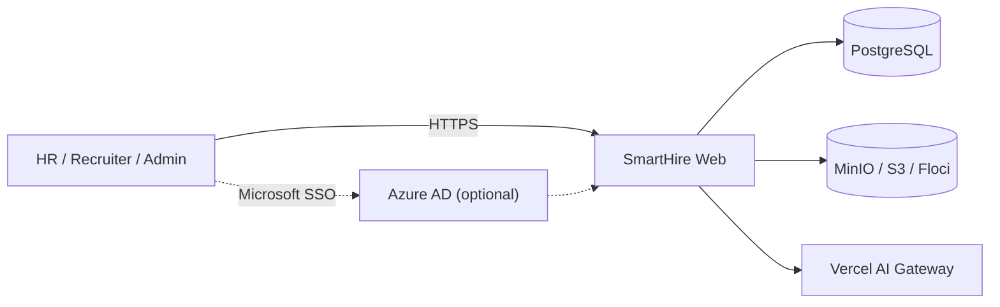
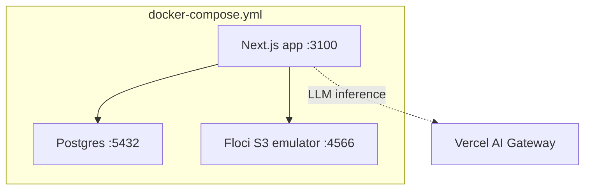
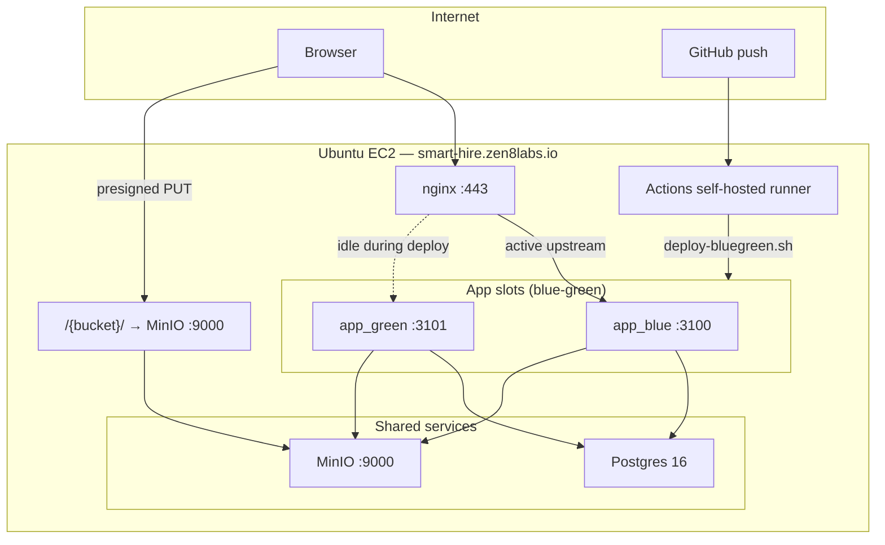
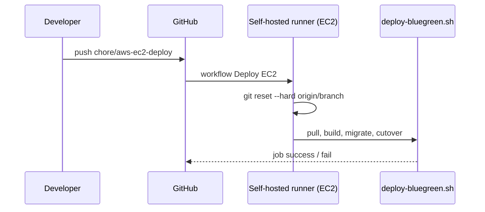
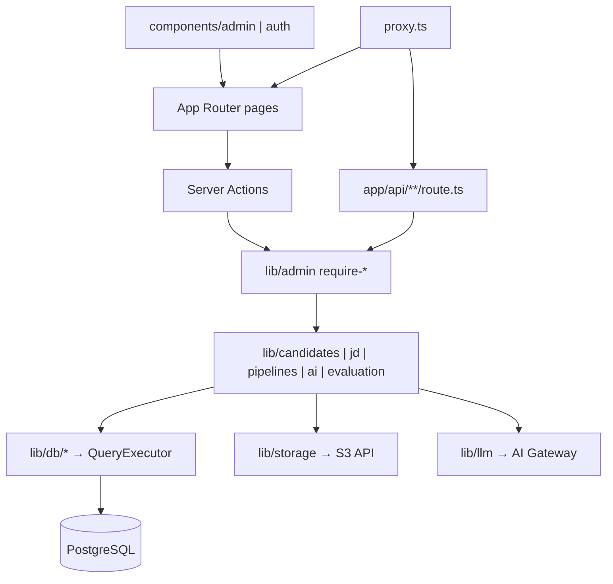
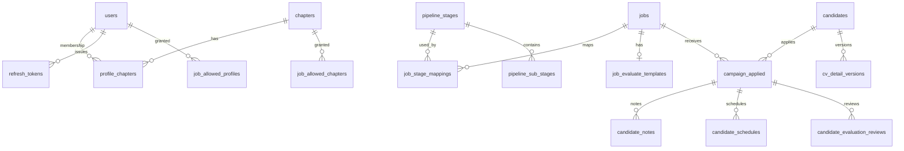
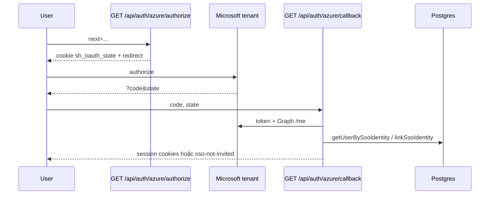
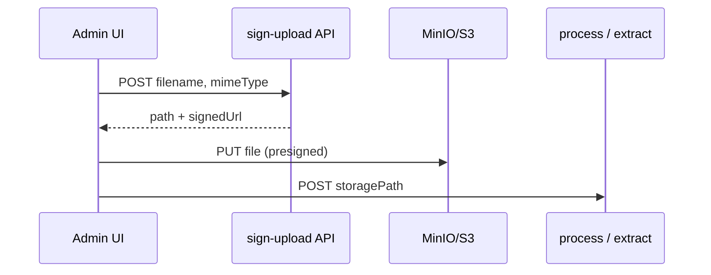
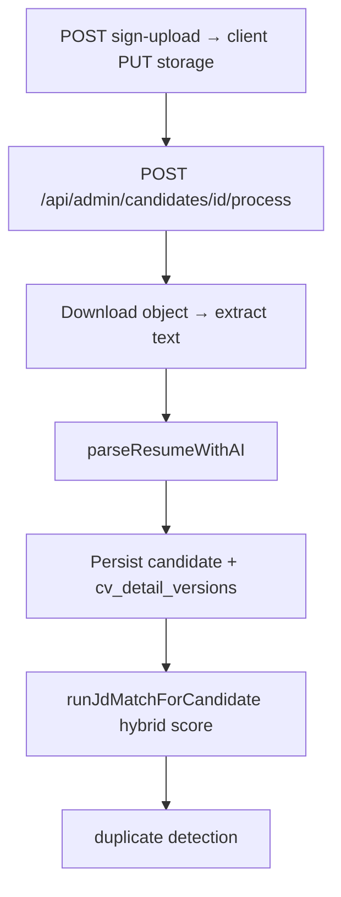

# SmartHire — Tài liệu kiến trúc

> **Branch tham chiếu:** `chore/aws-ec2-deploy` (deploy EC2) / `refactor/database-queries-and-schemas` (app)  
> **Nguồn sự thật:** code + `migrations/` + `.env.example` + `.env.production.example` + `docker-compose*.yml`  
> **Lưu ý:** `README.md` vẫn mô tả stack cũ (Supabase). Tài liệu này phản ánh **stack hiện tại**: Postgres tự quản lý, JWT auth, Azure AD (tuỳ chọn), object storage S3-compatible (Floci local / MinIO hoặc AWS S3 prod).

---

## 1. Tổng quan sản phẩm

SmartHire là ứng dụng web nội bộ hỗ trợ tuyển dụng:

- Quản lý **Job Description (JD)** — tạo/sửa, upload file, AI extract nội dung
- **Candidates pool** — upload CV → extract text → LLM parse → chấm khớp JD
- **Pipeline** theo từng job (stage / sub-stage)
- Ghi chú, lịch phỏng vấn, sinh **PDF đánh giá** bằng AI
- Quản lý user, chapter, phân quyền truy cập job

Không có portal ứng viên tự ứng tuyển; toàn bộ luồng do staff/HR vận hành.

---

## 2. Stack kỹ thuật

| Lớp | Công nghệ |
|-----|-----------|
| Framework | Next.js 16 (App Router), React 19, TypeScript |
| UI | HeroUI v3, Tailwind CSS v4, Lucide, `@dnd-kit`, TanStack Virtual |
| Database | PostgreSQL 16 (prod) / 15+ (local) qua `pg` + `node-pg-migrate` (không ORM) |
| Auth | Tự xây: bcrypt + access JWT (HS256) + opaque refresh token trong DB; Azure AD SSO (tuỳ chọn) |
| Object storage | AWS S3 API (`@aws-sdk/client-s3`): **Floci** (local), **MinIO** (EC2 prod mặc định), hoặc **AWS S3** thật |
| AI | Vercel AI SDK + AI Gateway (mặc định); Gemini tùy chọn |
| Documents | `pdf-parse` / `unpdf`, `mammoth`, `pdf-lib` |
| Validation | Zod v4 |
| Test | Vitest |
| Deploy | Docker standalone (`output: "standalone"`); prod **EC2** + nginx + **blue-green**; CI: GitHub Actions self-hosted runner |

---

## 3. Context & Container

### 3.1 System context



### 3.2 Local development (`docker-compose.yml`)



- App đọc `AWS_ENDPOINT_URL=http://floci:4566` (hoặc `localhost:4566` từ host)
- Bucket + CORS khởi tạo qua `.floci-init/init-s3.sh`

### 3.3 Production EC2 (blue-green)



| Thành phần | File / ghi chú |
|------------|----------------|
| Shared stack | `docker-compose.prod.yml` — `db`, `minio`, `minio-init`, profile `migrate` |
| App slots | `docker-compose.bluegreen.yml` — `app_blue` (:3100), `app_green` (:3101) |
| Deploy script | `deploy/deploy-bluegreen.sh` — build idle slot → health → switch nginx → stop old |
| nginx upstream | `deploy/nginx/active-app-upstream.conf` → symlink `upstreams/app-{blue,green}.conf` |
| Trạng thái slot | `deploy/.active-slot` trên server (`blue` \| `green`, không commit) |

**Luồng upload file** — giữ nguyên path-style trên cùng domain:

1. `POST .../sign-upload` → presigned PUT URL
2. Browser `PUT` → `https://smart-hire.zen8labs.io/{S3_BUCKET}/jd/...`
3. nginx `location ^~ /smart-hire-bucket/` → MinIO `:9000` (không dùng prefix `/minio/`)

Truy cập server: AWS SSM (không SSH). Chi tiết: `docs/smart-hire-vm-access-guide.md`, `docs/huong-dan-deploy-aws-ec2.md`, `docs/blue-green-ec2.md`.

### 3.4 CI/CD



- Workflow: `.github/workflows/deploy-ec2.yml`
- Runner label: `smarthire-ec2` (cài một lần trên EC2 — `docs/ci-cd-ec2.md`)
- **Vercel Git deploy tắt:** `vercel.json` → `"git": { "deploymentEnabled": false }` (prod là EC2, không phải `*.vercel.app`)

---

## 4. Cấu trúc thư mục

| Path | Vai trò |
|------|---------|
| `app/` | Pages (App Router), API routes, server actions |
| `components/` | UI (`admin/*`, `auth/*`) |
| `lib/db/` | Repository SQL (`QueryExecutor`, transactions) |
| `lib/auth/` | JWT, session cookies, refresh tokens, password, Azure OAuth |
| `lib/authz/` | Permission catalog helpers, `can()`, job ACL, salary redact |
| `lib/admin/` | Request auth DAL, RBAC guards |
| `lib/candidates/`, `lib/jd/`, `lib/pipelines/`, `lib/evaluation/` | Domain services |
| `lib/ai/`, `lib/llm/` | Parse CV/JD, match, fill evaluation, provider config |
| `lib/storage/` | S3 client + presigned URLs + key helpers |
| `migrations/` | Schema chuẩn (`node-pg-migrate`) |
| `proxy.ts` | Session refresh + coarse route protection |
| `docker-compose.yml` | Local: app + Postgres + Floci |
| `docker-compose.prod.yml` | EC2 shared: db + MinIO + migrate |
| `docker-compose.bluegreen.yml` | EC2 overlay: `app_blue` / `app_green` |
| `deploy/` | `deploy.sh`, `deploy-bluegreen.sh`, nginx upstreams/snippets |
| `.github/workflows/deploy-ec2.yml` | Auto deploy on push (self-hosted runner) |
| `vercel.json` | `deploymentEnabled: false` — không deploy Git lên Vercel |
| `docs/` | Kiến trúc, deploy EC2, blue-green, CI/CD, VM access |

---

## 5. Kiến trúc phân lớp



**Pattern chính:**

- **Repository + `QueryExecutor`** — pool / transaction / test doubles (`lib/db/config/client.ts`)
- **`withTransaction`** — multi-write (JD match, CV update, user admin)
- **Request-scoped DAL** — `cache()` + `getRequestAuth()`
- **App-layer authorization** — không dùng Postgres RLS
- **Immutable CV versions** trên `cv_detail_versions`, snapshot aggregate trên `candidates`

---

## 6. Mô hình dữ liệu

Nguồn: `migrations/*.sql` (17 file).



### Bảng cốt lõi

| Bảng | Ý nghĩa |
|------|---------|
| `users` | Identity + profile; `role`: `admin` \| `hr` \| `recruiter` \| `none`; `password_hash`; `sso_provider` / `sso_subject_id` |
| `chapters`, `profile_chapters` | Đơn vị tuyển dụng; membership `head` / `member` |
| `jobs` | JD + metadata + S3 path; đánh giá qua `job_evaluate_templates` |
| `pipeline_stages`, `pipeline_sub_stages`, `job_stage_mappings` | Cấu hình pipeline theo job |
| `candidates` | Hồ sơ người; unique email/phone khi có |
| `campaign_applied` | Ứng viên × job; cache JD match + vị trí pipeline |
| `cv_detail_versions` | Phiên bản CV bất biến (hash, parse, match snapshot) |
| `candidate_notes`, `candidate_schedules` (+ interviewers) | Ghi chú / lịch |
| `job_allowed_profiles`, `job_allowed_chapters` | ACL theo job (profile grant; chapter grant = **head only**) |
| `permissions`, `role_permissions`, `group_permissions` | Catalog permission + gán theo role / chapter (group seed rỗng ban đầu) |
| `job_evaluate_templates`, `candidate_evaluation_reviews` | Evaluation criteria + bản đánh giá + `preview_token` |
| `refresh_tokens` | Opaque refresh (hash SHA-256) |

Soft delete qua `deleted_at` trên nhiều bảng. Helper: `uuid_generate_v7()`, `merge_candidates()`, `pgcrypto`.

---

## 7. Auth & phân quyền

### 7.1 Authentication (email/password)

```mermaid
sequenceDiagram
  participant U as User
  participant SA as signIn action
  participant DB as Postgres
  participant B as Browser

  U->>SA: email + password
  SA->>DB: verify bcrypt, create refresh_tokens
  SA-->>B: cookies sh_access_token + sh_refresh_token
  Note over B: Access JWT ~15m; refresh opaque ~30d
  B->>Proxy: request có cookie hết hạn access
  Proxy->>DB: rotate refresh
  Proxy-->>B: cookie mới + tiếp tục request
```

- Invite-only (không self-signup; `/signup` redirect)
- Access JWT: cookie `sh_access_token`, claims `sub` + `role`
- Refresh: cookie `sh_refresh_token`, lưu hash trong DB; rotate mỗi lần dùng
- `COOKIE_SECURE` — tắt Secure cookie tạm khi test HTTP thuần (production HTTPS: để unset)

### 7.2 Microsoft SSO (Azure AD / Entra ID) — tuỳ chọn

`lib/auth/azure.ts` — authorization-code + PKCE, **một tenant** (`AZURE_AD_TENANT_ID`):



- Chỉ account thuộc tenant công ty (`AZURE_AD_TENANT_ID`), không `/organizations` hay `/common`
- Invite-only: SSO **không** tự tạo user; link email đã được admin provision
- Env: `AZURE_AD_CLIENT_ID`, `AZURE_AD_CLIENT_SECRET`, `AZURE_AD_TENANT_ID`, `AZURE_AD_REDIRECT_URI`
- Production redirect: `https://smart-hire.zen8labs.io/api/auth/azure/callback`

### 7.3 Authorization (RBAC)

> Chi tiết đầy đủ: [docs/rbac.md](./rbac.md).

Phân quyền là **app-layer** (không RLS). Catalog permission nằm trong Postgres; logic kiểm tra tập trung ở `lib/authz/`.

**Permission catalog** (`permissions` + `role_permissions`):

| Permission | `admin`/`hr` | `recruiter` | Ý nghĩa |
|------------|--------------|-------------|---------|
| `admin.access` | ✓ | ✓ | Vào `/admin` |
| `job.view` | ✓ (mọi job) | ✓ scoped | Xem JD / pipeline |
| `job.manage` | ✓ | — | CRUD JD + viewer grants |
| `candidate.view` / `candidate.manage` | ✓ | ✓ scoped | Ứng viên trên job được phép |
| `salary.view` | ✓ | —* | Xem `expected_salary` |
| `users.manage` / `pipelines.manage` | ✓ | — | Setup HR |

\* Chapter **head** trên JD được grant chapter vẫn xem salary qua `can(..., 'salary.view', { jobId })`, dù role không có `salary.view`.

**Job ACL** (`job_allowed_profiles` / `job_allowed_chapters`):

- Recruiter xem job khi: có grant email **hoặc** là `head` của chapter trong `job_allowed_chapters`.
- Chapter **member** (không head) **không** được access chỉ nhờ chapter grant — cần profile grant riêng.
- HR/admin bypass ACL (thấy mọi job).
- List rỗng nếu recruiter không có grant; deep-link jobId → 403 / redirect.

**API chính:** `can()`, `canViewJob()`, `canViewSalary()` trong `lib/authz/`; guard `requireJobViewAccess` / `requireJobViewForApplication`.

**Lớp enforce:**

1. `proxy.ts` — chỉ yêu cầu đăng nhập cho `/admin` (không chặn theo JWT `role`; staff thật sự do layout/DB quyết định)
2. `app/admin/layout.tsx` — `hasAdminAccess()` / `isStaff`
3. API — `requireStaffForRequest` / `requireHrForRequest` (`requireAdminForRequest` là alias deprecated = HR); job-scoped thêm `requireJobViewAccess`
4. UI — khóa card/nav theo `job.manage` / `isHr`; redacted `expected_salary` khi thiếu `salary.view`

---

## 8. Object storage

`lib/storage/s3.ts` — một bucket, key prefix theo loại file: `jd/`, `cv/`, `evaluation/`, ...

| Môi trường | Backend | `AWS_ENDPOINT_URL` | Credentials |
|------------|---------|-------------------|-------------|
| Local | Floci `:4566` | `http://localhost:4566` hoặc `http://floci:4566` | `test` / `test` |
| EC2 prod (mặc định) | MinIO container | `https://smart-hire.zen8labs.io` | `MINIO_ROOT_*` → map vào `AWS_ACCESS_KEY_ID` / `SECRET` trong compose |
| EC2 / cloud (tuỳ chọn) | AWS S3 thật | **unset** | IAM instance profile hoặc access key |

**Presigned browser PUT:**

- Server ký URL với `requestChecksumCalculation: WHEN_REQUIRED` (tránh checksum params trong URL mà browser không gửi)
- Client: `fetch(signedUrl, { method: "PUT", body: file, headers: { Content-Type } })`
- Production: nginx `location ^~ /smart-hire-bucket/` phải có trong **cả** block HTTP và HTTPS (certbot)

---

## 9. Luồng nghiệp vụ quan trọng

### 9.1 Upload JD / CV



### 9.2 Xử lý CV (parse + match + dedupe)



Hybrid score: công thức + LLM; trọng số `JD_MATCH_AI_WEIGHT` (mặc định `0.65`). AI chạy **đồng bộ trong request** Next.js.

### 9.3 JD extract & Evaluation PDF

| Workflow | Entry | Module |
|----------|--------|--------|
| Extract JD | `POST .../job-descriptions/extract` | `lib/ai/extract-jd.ts` |
| Fill evaluation PDF | `POST .../candidates/[id]/evaluations` | `lib/ai/fill-candidate-evaluation.ts` |
| Public PDF preview | `GET /api/public/evaluation-preview/[token]` | Token hex + expiry/revoke |

---

## 10. API surface

### Server Actions

| File | Actions |
|------|---------|
| `app/auth/actions.ts` | `signIn`, `signOut` |
| `app/admin/actions.ts` | CRUD user admin, chapter membership |
| `app/account/actions.ts` | Đổi username/password |

### HTTP (`app/api/**`) — ~49 handlers

| Nhóm | Prefix / route |
|------|----------------|
| Auth | `POST /api/auth/refresh`, `GET /api/auth/azure/authorize`, `GET /api/auth/azure/callback` |
| Public | `GET /api/public/evaluation-preview/[token]` |
| Jobs / JD | `/api/admin/job-descriptions/*`, `/api/admin/job-openings/*` (sign-upload) |
| Candidates | `/api/admin/candidates/*` |
| Pipelines | `/api/admin/pipelines/*` |
| Chapters / users | `/api/admin/chapters/*`, `/api/admin/users`, `/api/admin/accounts/search` |

Naming UI/API còn dùng `job-descriptions` / `job-openings`; entity DB thống nhất `jobs`.

### Pages chính

| Path | Mục đích |
|------|----------|
| `/login` | Email/password + nút Microsoft (nếu cấu hình Azure) |
| `/dashboard` | Launcher theo role |
| `/admin/jd/**` | Danh sách JD + pipeline + evaluation |
| `/admin/candidates` | Candidates pool |
| `/admin/users`, `/chapters`, `/pipelines`, `/evaluation-template` | Setup HR |
| `/evaluation-preview/[token]` | Xem PDF đánh giá qua token |

---

## 11. Triển khai & cấu hình

### 11.1 Local

```bash
cp .env.example .env
docker compose up -d
npm run db:migrate
npm run dev   # :3000
```

| Service | File | Port |
|---------|------|------|
| App (dev) | — | 3000 |
| App (Docker) | `docker-compose.yml` | 3100 |
| Postgres | compose | 5432 |
| Floci | compose | 4566 |

### 11.2 Production EC2

| Thành phần | Chi tiết |
|------------|----------|
| Host | `i-040a0bcdfe9618b56`, `smart-hire.zen8labs.io`, Ubuntu 24.04 |
| App | Blue-green: `app_blue` :3100, `app_green` :3101 |
| Data | Postgres 16 + MinIO (volume Docker) |
| Reverse proxy | nginx → upstream active slot; `/{bucket}/` → MinIO |
| TLS | certbot `--nginx` |
| Deploy tay | `./deploy/deploy-bluegreen.sh chore/aws-ec2-deploy` |
| Deploy CI | Push branch → `.github/workflows/deploy-ec2.yml` |

**Lần đầu blue-green:** cấu hình nginx `include .../active-app-upstream.conf` — xem `docs/blue-green-ec2.md`.

**Fallback đơn giản** (một container, downtime vài giây): `./deploy/deploy.sh`.

**Biến môi trường production** (`.env.production.example` → `.env` trên server):

| Biến | Mục đích |
|------|----------|
| `POSTGRES_*`, `DATABASE_URL` | Postgres (host `db` trong compose) |
| `AUTH_JWT_SECRET` | HMAC access JWT |
| `COOKIE_SECURE` | Chỉ set `false` khi test HTTP tạm |
| `AZURE_AD_*` | Microsoft SSO (tuỳ chọn); cần `AZURE_AD_TENANT_ID` |
| `AI_GATEWAY_API_KEY`, `JD_MATCH_AI_WEIGHT` | AI |
| `MINIO_ROOT_USER`, `MINIO_ROOT_PASSWORD` | MinIO + credentials app |
| `S3_BUCKET` | Tên bucket (mặc định `smart-hire-bucket`; **phải khớp** nginx `location`) |
| `AWS_REGION` | Region ký URL (vd. `ap-southeast-1`) |
| `AWS_ENDPOINT_URL` | Prod MinIO: `https://smart-hire.zen8labs.io` (không `/minio`) |

Scripts: `npm run db:migrate` (service `migrate` trong compose).

### 11.3 Blue-green cutover (tóm tắt)

1. Slot **active** phục vụ user (blue `:3100` hoặc green `:3101`)
2. Deploy build lên slot **idle** → `curl` health
3. Symlink `active-app-upstream.conf` → slot mới → `nginx reload`
4. Stop container slot cũ
5. **Rollback nhanh:** đổi symlink ngược (nếu container cũ còn) — `docs/blue-green-ec2.md`

Migrate chạy **một lần** trước cutover; nên backward-compatible khi hai slot chạy song song vài phút.

---

## 12. Quyết định kiến trúc đáng chú ý

| Quyết định | Lý do / hệ quả |
|------------|----------------|
| Bỏ Supabase runtime | Auth, DB, Storage tự host |
| Raw SQL repositories | Kiểm soát query; test qua `QueryExecutor` |
| Auth ở app layer (không RLS) | ACL chapter + job grant trong TypeScript |
| Presigned PUT trực tiếp từ browser | Giảm tải app; cần CORS + nginx path khớp chữ ký |
| MinIO trên EC2 thay S3 | Không cần bucket AWS; tự vận hành volume |
| Blue-green trên một EC2 | Gần zero downtime; tạm 2 container app khi deploy |
| Path-style bucket trên cùng domain | Presigned URL khớp chữ ký nginx → MinIO |
| Self-hosted GitHub runner | Auto deploy không cần SSH / SSM SendCommand |
| `vercel.json` tắt Git deploy | Prod EC2; Vercel chỉ còn cho AI Gateway API (tuỳ chọn) |
| AI sync trong request | Đơn giản MVP; rủi ro timeout CV lớn |
| Immutable `cv_detail_versions` | Audit + chống upload trùng (hash) |

---

## 13. Tài liệu liên quan

| Tài liệu | Nội dung |
|----------|----------|
| **`docs/architecture.md` (file này)** | Kiến trúc stack hiện tại |
| `docs/huong-dan-deploy-aws-ec2.md` | Hướng dẫn deploy EC2 (tiếng Việt) |
| `docs/aws-ec2-deploy.md` | Checklist deploy (tiếng Anh) |
| `docs/blue-green-ec2.md` | Blue-green setup, rollback |
| `docs/ci-cd-ec2.md` | GitHub Actions runner + tắt check Vercel |
| `docs/smart-hire-vm-access-guide.md` | SSO/SSM vào EC2 |
| `vercel.json` | Tắt auto-deploy Vercel từ Git |
| `migrations/*.sql` | Schema authoritative |
| `.env.example` / `.env.production.example` | Env local vs prod |
| `README.md` | **Lỗi thời** (Supabase, Vercel hosting) |

---

## 14. Seed & vận hành nhanh

- Admin seed: `migrations/1783920060000_seed-admin.sql`  
  - Email: `admin@smart-hire.test`  
  - Password: `SmartHireTestAdmin!1`
- **Local:** `.env` ← `.env.example` → `docker compose up` → `npm run db:migrate` → `npm run dev`
- **EC2 lần đầu:** `docs/huong-dan-deploy-aws-ec2.md` + `docs/blue-green-ec2.md`
- **Sau đó:** `git push` → CI deploy, hoặc `./deploy/deploy-bluegreen.sh chore/aws-ec2-deploy`
