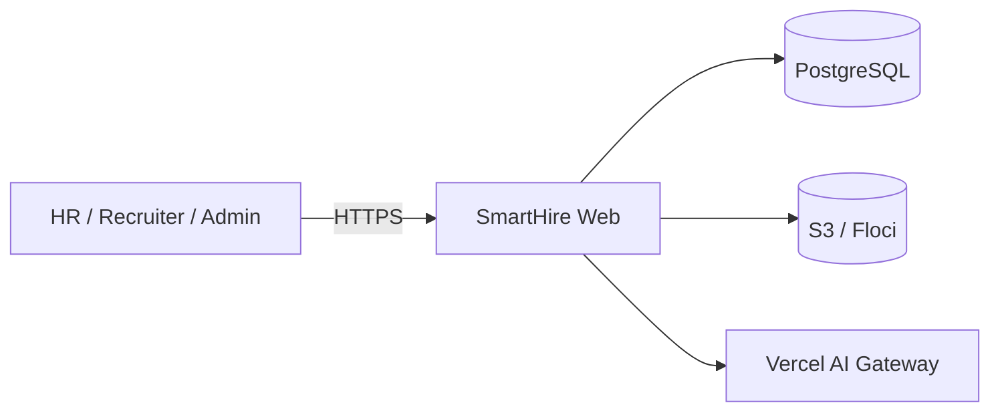
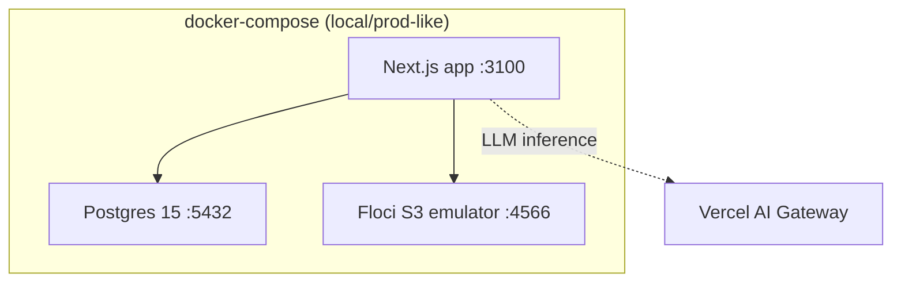
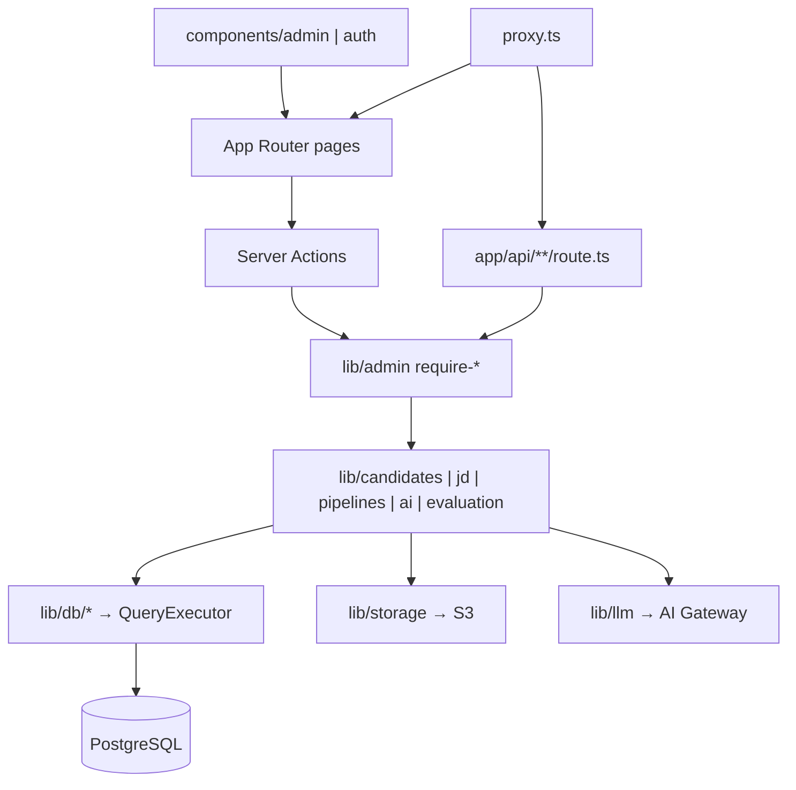
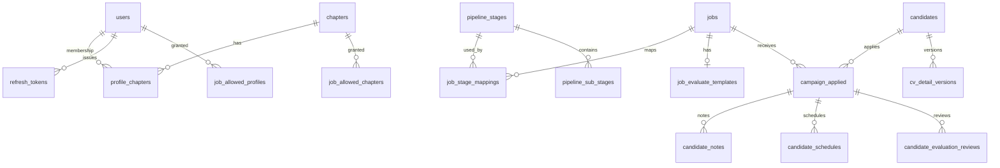
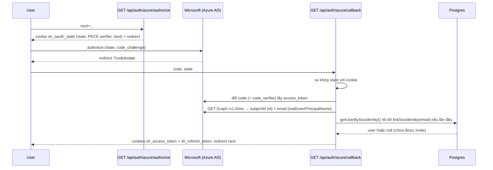
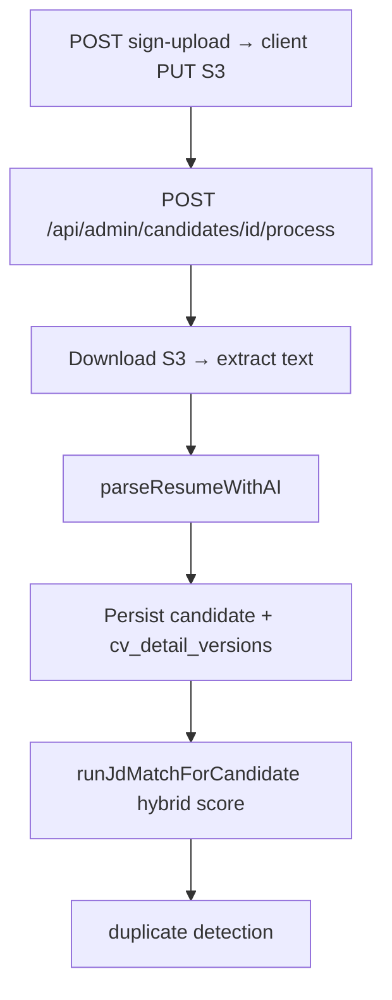

# SmartHire — Tài liệu kiến trúc

> **Branch:** `refactor/database-queries-and-schemas`  
> **Nguồn sự thật:** code + `migrations/` + `.env.example`  
> **Lưu ý:** `README.md` và một số file trong `docs/` vẫn mô tả stack cũ (Supabase Auth / Storage / Edge Functions). Tài liệu này phản ánh **stack hiện tại** sau khi tách Supabase, chuyển Postgres tự quản lý, JWT auth, và S3.

---

## 1. Tổng quan sản phẩm

SmartHire là ứng dụng web nội bộ hỗ trợ tuyển dụng:

- Quản lý **Job Description (JD)** — tạo/sửa, upload file, AI extract nội dung
- **Candidates pool** — upload CV → extract text → LLM parse → chấm khớp JD
- **Pipeline** theo từng job (stage / sub-stage)
- Ghi chú, lịch phỏng vấn, sinh **PDF đánh giá** bằng AI
- Quản lý user, chapter, phân quyền truy cập job

Không có portal ứng viên tự ứng tuyển; toàn bộ luồng do staff/HR vận hành.

---

## 2. Stack kỹ thuật

| Lớp | Công nghệ |
|-----|-----------|
| Framework | Next.js 16 (App Router), React 19, TypeScript |
| UI | HeroUI v3, Tailwind CSS v4, Lucide, `@dnd-kit`, TanStack Virtual |
| Database | PostgreSQL 15 qua `pg` + `node-pg-migrate` (không ORM) |
| Auth | Tự xây: bcrypt + access JWT (HS256) + opaque refresh token trong DB |
| Object storage | AWS S3 (`@aws-sdk/client-s3`); local dùng Floci (S3-compatible) |
| AI | Vercel AI SDK + AI Gateway (mặc định); Gemini tùy chọn (stub) |
| Documents | `pdf-parse` / `unpdf`, `mammoth`, `pdf-lib` |
| Validation | Zod v4 |
| Test | Vitest |
| Deploy | Docker standalone (`output: "standalone"`, port 3100); demo Vercel |

---

## 3. Context & Container

### 3.1 System context



### 3.2 Containers (runtime)



---

## 4. Cấu trúc thư mục

| Path | Vai trò |
|------|---------|
| `app/` | Pages (App Router), API routes, server actions |
| `components/` | UI (`admin/*`, `auth/*`) |
| `lib/db/` | Repository SQL (`QueryExecutor`, transactions) |
| `lib/auth/` | JWT, session cookies, refresh tokens, password |
| `lib/admin/` | Request auth DAL, RBAC guards |
| `lib/candidates/`, `lib/jd/`, `lib/pipelines/`, `lib/evaluation/` | Domain services |
| `lib/ai/`, `lib/llm/` | Parse CV/JD, match, fill evaluation, provider config |
| `lib/storage/` | S3 client + key helpers |
| `migrations/` | Schema chuẩn (`node-pg-migrate`) |
| `proxy.ts` | Session refresh + coarse route protection (thay `middleware.ts`) |
| `docker-compose.yml` / `Dockerfile` | App + Postgres + Floci |

---

## 5. Kiến trúc phân lớp



**Pattern chính:**

- **Repository + `QueryExecutor`** — pool / transaction / test doubles (`lib/db/config/client.ts`)
- **`withTransaction`** — multi-write (JD match, CV update, user admin)
- **Request-scoped DAL** — `cache()` + `getRequestAuth()`
- **App-layer authorization** — không dùng Postgres RLS
- **Immutable CV versions** trên `cv_detail_versions`, snapshot aggregate trên `candidates`

---

## 6. Mô hình dữ liệu

Nguồn: `migrations/*.sql` (15 file).



### Bảng cốt lõi

| Bảng | Ý nghĩa |
|------|---------|
| `users` | Identity + profile; `role`: `admin` \| `hr` \| `recruiter` \| `none`; `password_hash` |
| `chapters`, `profile_chapters` | Đơn vị tuyển dụng; membership `head` / `member` |
| `jobs` | JD + metadata + S3 path (đã gộp job openings + descriptions); `criteria` bị drop, đánh giá chuyển hết sang `job_evaluate_templates` |
| `pipeline_stages`, `pipeline_sub_stages`, `job_stage_mappings` | Cấu hình pipeline theo job |
| `candidates` | Hồ sơ người; unique email/phone khi có |
| `campaign_applied` | Ứng viên × job; cache JD match + vị trí pipeline |
| `cv_detail_versions` | Phiên bản CV bất biến (hash, parse, match snapshot) |
| `candidate_notes`, `candidate_schedules` (+ interviewers) | Ghi chú / lịch |
| `job_allowed_profiles`, `job_allowed_chapters` | ACL theo job |
| `job_evaluate_templates`, `candidate_evaluation_reviews` | Evaluation criteria (file upload **hoặc** `content_text`, loại trừ lẫn nhau) + bản đánh giá + `preview_token` |
| `refresh_tokens` | Opaque refresh (hash SHA-256) |

Soft delete qua `deleted_at` trên nhiều bảng. Helper: `uuid_generate_v7()`, `merge_candidates()`, `pgcrypto`.

---

## 7. Auth & phân quyền

### 7.1 Authentication

```mermaid
sequenceDiagram
  participant U as User
  participant SA as signIn action
  participant DB as Postgres
  participant B as Browser

  U->>SA: email + password
  SA->>DB: verify bcrypt, create refresh_tokens
  SA-->>B: cookies sh_access_token + sh_refresh_token
  Note over B: Access JWT ~15m; refresh opaque ~30d
  B->>Proxy: request có cookie hết hạn access
  Proxy->>DB: rotate refresh
  Proxy-->>B: cookie mới + tiếp tục request
```

- Invite-only (không self-signup; `/signup` redirect)
- Access JWT: cookie `sh_access_token`, claims `sub` + `role`
- Refresh: cookie `sh_refresh_token`, lưu hash trong DB; rotate mỗi lần dùng
- `COOKIE_SECURE` — cho phép cookie insecure trên HTTP thuần (deploy tạm)

**Microsoft SSO (Azure AD / Entra ID)** — `lib/auth/azure.ts`:



- Authorization-code flow + PKCE (S256), endpoint `/organizations` (mọi tổ chức Azure AD, không giới hạn 1 tenant, **không** nhận personal Microsoft account); không dùng SDK, tự dựng như phần còn lại của `lib/auth/*`
- Không parse/verify id_token JWT — Graph API chấp nhận access token chính là trust anchor
- Match user theo `sso_subject_id` ổn định của IdP cho lần đăng nhập sau (`getUserBySsoIdentity`); lần đầu link theo email (`linkSsoIdentity`) nhưng **chỉ vào user admin đã tạo sẵn** (`sso_provider IS NULL`) — app invite-only nên SSO không bao giờ tự tạo user mới; email không khớp → redirect `/login?reason=sso-not-invited`
- Cột `users.sso_provider` / `users.sso_subject_id` (nullable, unique index khi có giá trị) đã có từ trước ở migration `1783920057258_users-auth-credentials.sql`
- Admin có thể tạo user "SSO only" (không set password) qua `Add user` (checkbox `sso_only`) — user đó chỉ đăng nhập được bằng Microsoft
- Env: `AZURE_AD_CLIENT_ID`, `AZURE_AD_CLIENT_SECRET`, `AZURE_AD_REDIRECT_URI`

### 7.2 Authorization (RBAC)

| Capability | Ai có |
|------------|--------|
| `isHr` (`admin` / `hr`) | Quản lý gần như toàn bộ product |
| Staff + chapter | Recruiter scoped theo chapter / job ACL |
| `none` | Chỉ dashboard (trừ khi có chapter membership) |
| Job ACL | `job_allowed_profiles` + `job_allowed_chapters`; chapter head cho một số thao tác JD |

**Lớp enforce:**

1. `proxy.ts` — role ≠ `none` cho `/admin`; refresh session cho `/api/admin`
2. `app/admin/layout.tsx` — `getRequestAuth()` → `isStaff`
3. API — `requireAdminForRequest` / `requireStaffForRequest` / `requireHrForRequest`
4. UI — khóa card theo role trên dashboard

---

## 8. Luồng nghiệp vụ quan trọng

### 8.1 Xử lý CV (parse + match + dedupe)



Hybrid score: công thức + LLM; trọng số `JD_MATCH_AI_WEIGHT` (mặc định `0.65`).

Không có worker/queue riêng — AI chạy **đồng bộ trong request** Next.js. UI có upload queue + polling phía client.

### 8.2 JD extract & Evaluation PDF

| Workflow | Entry | Module |
|----------|--------|--------|
| Extract JD | `POST .../job-descriptions/extract` | `lib/ai/extract-jd.ts` |
| Fill evaluation PDF | `POST .../candidates/[id]/evaluations` | `lib/ai/fill-candidate-evaluation.ts` |
| Public PDF preview | `GET /api/public/evaluation-preview/[token]` | Token hex + expiry/revoke |

---

## 9. API surface

### Server Actions

| File | Actions |
|------|---------|
| `app/auth/actions.ts` | `signIn`, `signOut` |
| `app/admin/actions.ts` | CRUD user admin, chapter membership |
| `app/account/actions.ts` | Đổi username/password |

### HTTP (`app/api/**`) — ~49 handlers

| Nhóm | Prefix / route |
|------|----------------|
| Auth | `POST /api/auth/refresh`, `GET /api/auth/azure/authorize`, `GET /api/auth/azure/callback` |
| Public | `GET /api/public/evaluation-preview/[token]` |
| Jobs / JD | `/api/admin/job-descriptions/*`, `/api/admin/job-openings/*` |
| Candidates | `/api/admin/candidates/*` (process, dedupe, CV history, notes, pipeline, evaluations…) |
| Pipelines | `/api/admin/pipelines/*` |
| Chapters / users | `/api/admin/chapters/*`, `/api/admin/users`, `/api/admin/accounts/search` |

Naming UI/API còn dùng `job-descriptions` / `job-openings`; entity DB đã thống nhất thành `jobs`.

### Pages chính

| Path | Mục đích |
|------|----------|
| `/login` | Đăng nhập |
| `/dashboard` | Launcher theo role |
| `/admin/jd/**` | Danh sách JD + pipeline + evaluation |
| `/admin/candidates` | Candidates pool |
| `/admin/users`, `/chapters`, `/pipelines`, `/evaluation-template` | Setup HR |
| `/evaluation-preview/[token]` | Xem PDF đánh giá qua token |

---

## 10. Triển khai & cấu hình

### Docker Compose

- `app` — image `smart_hire:latest`, port **3100**
- `db` — Postgres 15, DB `smart_hire`
- `floci` — giả lập S3, port **4566**

### Biến môi trường (`.env.example`)

| Biến | Mục đích |
|------|----------|
| `DATABASE_URL` | Postgres (app + migrate) |
| `AUTH_JWT_SECRET` | HMAC access JWT |
| `COOKIE_SECURE` | Override Secure cookie |
| `AZURE_AD_CLIENT_ID`, `AZURE_AD_CLIENT_SECRET`, `AZURE_AD_REDIRECT_URI` | App registration cho "Sign in with Microsoft" |
| `AI_GATEWAY_API_KEY` | Vercel AI Gateway |
| `LLM_PROVIDER` / `LLM_MODEL` / `LLM_JD_EXTRACT_MODEL` | Chọn provider/model |
| `JD_MATCH_AI_WEIGHT` | Blend score công thức ↔ LLM |
| `S3_BUCKET`, `AWS_*`, `AWS_ENDPOINT_URL` | S3 / Floci |

Scripts: `db:migrate`, `db:migrate:down`, `db:migrate:create`.

---

## 11. Quyết định kiến trúc đáng chú ý

| Quyết định | Lý do / hệ quả |
|------------|----------------|
| Bỏ Supabase runtime | Auth, DB, Storage tự host; giảm phụ thuộc SaaS |
| Raw SQL repositories | Kiểm soát query/performance; test qua `QueryExecutor` |
| Auth ở app layer (không RLS) | Logic ACL phức tạp (chapter + job grant) dễ đọc hơn trong TypeScript |
| AI sync trong request | Đơn giản cho hackathon/MVP; rủi ro timeout với CV lớn |
| Immutable `cv_detail_versions` | Audit + restore version; hash chống upload trùng |
| `proxy.ts` thay middleware | Theo convention Next.js mới của repo |

---

## 12. Tài liệu liên quan & trạng thái

| Tài liệu | Trạng thái |
|----------|------------|
| **`docs/architecture.md` (file này)** | Phản ánh branch hiện tại |
| `migrations/*.sql` | Schema authoritative |
| `README.md` | Một phần **lỗi thời** (Supabase Auth, `middleware.ts`) |
| `docs/candidate-cv-duplicate-flow.md` | Logic còn đúng một phần; path Edge Function cũ |
| `docs/candidate-cv-content-hash-design.md` | Schema hash đã chuyển sang `cv_detail_versions` |
| `docs/deployment/*` | Chạy lại verify trước khi dùng |

---

## 13. Seed & vận hành nhanh

- Admin seed: migration `1783920060000_seed-admin.sql` (`admin@smart-hire.test`)
- Local: cấu hình `.env` từ `.env.example` → `docker compose up` → `npm run db:migrate` → `npm run dev`
)
