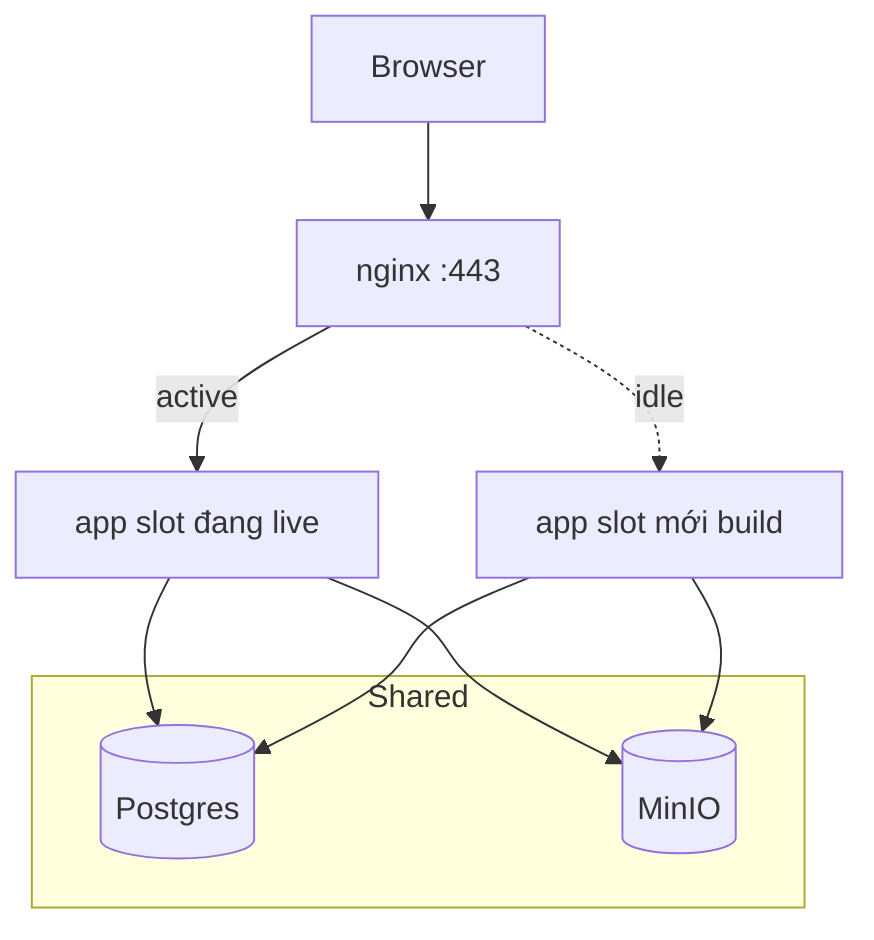

# Blue-green deploy trên EC2 (SmartHire)

Triển khai **hai slot app** (blue / green) trên cùng một EC2. nginx chỉ proxy tới slot **đang active**; deploy bản mới lên slot **idle**, health check OK rồi mới chuyển traffic.

**DB + MinIO:** một instance dùng chung (không blue-green) — migrate chạy một lần trước cutover.

---

## Sơ đồ



| Slot | Container | Port host |
|------|-----------|-----------|
| **blue** | `smarthire_app_blue` | `127.0.0.1:3100` |
| **green** | `smarthire_app_green` | `127.0.0.1:3101` |

File trạng thái trên server (không commit): `deploy/.active-slot` → `blue` hoặc `green`.

---

## So với `deploy.sh` hiện tại

| | `deploy.sh` | `deploy-bluegreen.sh` |
|---|-------------|------------------------|
| Downtime | Vài giây khi recreate container | Gần 0 khi cutover nginx |
| RAM | 1 app container | Tạm 2 app khi deploy (vài phút) |
| Rollback | Pull code + deploy lại | Đổi symlink upstream + `nginx reload` (~ vài giây) |
| Độ phức tạp | Thấp | Trung bình |

---

## Lần đầu bật blue-green

### 1. Dừng app single-slot cũ (nếu có)

```bash
cd /opt/smarthire/app
docker compose -f docker-compose.prod.yml stop app
docker compose -f docker-compose.prod.yml rm -f app
```

### 2. Cấu hình nginx dùng upstream động

Trong **mỗi** `server { }` (80 và 443), thay block:

```nginx
upstream smarthire_app {
    server 127.0.0.1:3100;
}
```

bằng:

```nginx
include /opt/smarthire/app/deploy/nginx/active-app-upstream.conf;
```

(Giữ `include ... minio-proxy.conf` và `location /` như cũ.)

Khởi tạo active mặc định blue:

```bash
cd /opt/smarthire/app
ln -sf upstreams/app-blue.conf deploy/nginx/active-app-upstream.conf
echo blue > deploy/.active-slot
sudo nginx -t && sudo systemctl reload nginx
```

### 3. Deploy blue-green lần đầu

```bash
chmod +x deploy/deploy-bluegreen.sh
./deploy/deploy-bluegreen.sh chore/aws-ec2-deploy
```

---

## Mỗi lần deploy (tự động hoặc tay)

```bash
./deploy/deploy-bluegreen.sh chore/aws-ec2-deploy
```

Script làm:

1. `git pull`
2. `build` image
3. `up -d db minio` + `minio-init`
4. `migrate`
5. Xác định slot idle (blue ↔ green)
6. `up -d app_<idle>` + build
7. `curl` health slot idle (`3100` hoặc `3101`)
8. Symlink `active-app-upstream.conf` → slot idle
9. `sudo nginx -t && reload`
10. Ghi `deploy/.active-slot`, **stop** container slot cũ (tiết RAM)

---

## Rollback nhanh (không build lại)

Nếu slot cũ **vẫn còn** container/image (chưa bị stop/xóa):

```bash
cd /opt/smarthire/app
ACTIVE=$(cat deploy/.active-slot)
if [ "$ACTIVE" = blue ]; then
  ln -sf upstreams/app-green.conf deploy/nginx/active-app-upstream.conf
  echo green > deploy/.active-slot
else
  ln -sf upstreams/app-blue.conf deploy/nginx/active-app-upstream.conf
  echo blue > deploy/.active-slot
fi
sudo nginx -t && sudo systemctl reload nginx
```

Nếu đã stop container cũ → rollback = chạy lại `./deploy/deploy-bluegreen.sh` (deploy về revision trước qua git).

---

## CI/CD (GitHub Actions)

Trong `.github/workflows/deploy-ec2.yml`, đổi bước deploy:

```yaml
run: |
  cd /opt/smarthire/app
  ./deploy/deploy-bluegreen.sh chore/aws-ec2-deploy
```

---

## Lưu ý migrate DB

- Migrate **trước** khi slot mới nhận traffic.
- Migration **backward-compatible** (thêm cột nullable, không xóa cột ngay) → blue và green có thể chạy song song vài phút.
- Breaking migration → cần maintenance window hoặc chỉ chạy một version tại một thời điểm.

---

## File liên quan

| File | Vai trò |
|------|---------|
| `docker-compose.bluegreen.yml` | Overlay: `app_blue`, `app_green` |
| `deploy/deploy-bluegreen.sh` | Script cutover |
| `deploy/nginx/upstreams/app-blue.conf` | upstream → :3100 |
| `deploy/nginx/upstreams/app-green.conf` | upstream → :3101 |
| `deploy/nginx/active-app-upstream.conf` | Symlink (trên server) |
