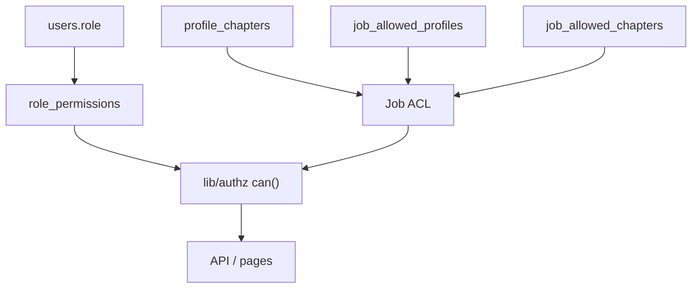

# Phân quyền SmartHire (Role / Permission / Group Permission)

Tài liệu chi tiết cho RBAC app-layer. Tóm tắt trong [architecture.md](./architecture.md) §7.3.

## Tổng quan

SmartHire **không dùng Postgres RLS**. Mọi kiểm tra quyền chạy trong TypeScript:

1. **Global role** — `users.role`: `admin` | `hr` | `recruiter` | `none`
2. **Chapter membership** — `profile_chapters.role`: `head` | `member` (group)
3. **Permission catalog** — `permissions` + `role_permissions` (+ `group_permissions` dự phòng)
4. **Job ACL** — `job_allowed_profiles` (email/user) + `job_allowed_chapters` (chapter; **chỉ head**)



## Roles

| Role | Ý nghĩa | Gán qua UI? |
|------|---------|-------------|
| `admin` | Superuser (seed/migration) | Không — chỉ DB |
| `hr` | Full recruiting / product | Có (`recruiting_access=hr`) |
| `recruiter` | Staff scoped theo job ACL | Có + chọn chapters |
| `none` | Chỉ dashboard (trừ khi vẫn còn chapter membership — defense-in-depth) | Có |

Chapter sub-role `head` / `member` nằm ở `profile_chapters`, không phải `users.role`.

## Permission catalog

Bảng `permissions` (seed trong migration `*_permissions-catalog.sql`):

| ID | Mô tả |
|----|--------|
| `admin.access` | Vào `/admin` |
| `job.view` | Xem job (HR: mọi job; recruiter: scoped ACL) |
| `job.manage` | CRUD JD + viewer grants |
| `candidate.view` | Xem pipeline / candidate trên job được phép |
| `candidate.manage` | Thêm/sửa candidate, pipeline moves |
| `salary.view` | Xem `expected_salary` (role HR/admin; chapter head qua check resource) |
| `users.manage` | Users & chapters |
| `pipelines.manage` | Pipeline setup |

**Gán mặc định (`role_permissions`):**

- `admin`, `hr` — toàn bộ catalog
- `recruiter` — `admin.access`, `job.view`, `candidate.view`, `candidate.manage`
- `none` — không có row

`group_permissions` (theo `chapter_id`) được tạo sẵn, seed rỗng — dùng sau nếu cần permission mặc định theo chapter.

Map TypeScript (phải khớp seed): [`lib/authz/permissions.ts`](../lib/authz/permissions.ts).

## Job ACL — ai được xem job?

| Điều kiện | Kết quả |
|-----------|---------|
| `admin` / `hr` | Xem mọi job (bypass ACL) |
| Có trong `job_allowed_profiles` | Xem job đó |
| Là `head` của chapter trong `job_allowed_chapters` | Xem job đó |
| Chỉ là `member` của chapter được grant | **Không** xem (cần profile grant riêng) |
| Không grant | List rỗng; deep-link → 403 / redirect `/admin/jd` |

HR cấu hình viewers khi tạo/sửa JD (`viewerEmails`, `viewerChapterIds`) qua [`lib/admin/jd-viewer-sync.ts`](../lib/admin/jd-viewer-sync.ts).

## Salary (`expected_salary`)

| Ai | Được xem? |
|----|-----------|
| HR / admin (`salary.view` trên role) | Có |
| Chapter **head** trên JD đó | Có |
| Recruiter chỉ có email grant | **Không** (field bị redact `null`) |

Redact ở API list/detail và pipeline RSC: [`lib/authz/redact-salary.ts`](../lib/authz/redact-salary.ts).

## API / helpers

| Module | Việc |
|--------|------|
| [`lib/authz/can.ts`](../lib/authz/can.ts) | `can()`, `canViewJob()`, `canViewSalary()`, `hasAdminAccess()` |
| [`lib/authz/job-access.ts`](../lib/authz/job-access.ts) | SQL ACL + `canViewJobViaAcl` |
| [`lib/authz/require-job-view.ts`](../lib/authz/require-job-view.ts) | Guard theo `jobId` |
| [`lib/authz/require-application-job-view.ts`](../lib/authz/require-application-job-view.ts) | Guard theo `campaign_applied` id |
| [`lib/admin/require-staff-request.ts`](../lib/admin/require-staff-request.ts) | `requireStaffForRequest`, `requireHrForRequest` |
| [`lib/admin/require-admin-request.ts`](../lib/admin/require-admin-request.ts) | **Deprecated** alias = HR (không phải admin-only) |

List jobs có filter `visibleToUserId` trên [`lib/db/jobs.ts`](../lib/db/jobs.ts) / [`lib/jd/list-with-enrichment.ts`](../lib/jd/list-with-enrichment.ts).

## Lớp enforce

1. **`proxy.ts`** — `/admin` chỉ cần đăng nhập; không chặn theo JWT `role === 'none'`
2. **`app/admin/layout.tsx`** — `hasAdminAccess()` (DB)
3. **API** — staff/HR guards + `requireJobViewAccess` trên route job/candidate
4. **UI** — nav/card theo `job.manage` / `isHr`; salary ẩn khi thiếu quyền

## Migration

```bash
npm run db:migrate
```

File: `migrations/1784512917324_permissions-catalog.sql`

## Kiểm thử

```bash
npx vitest run lib/authz lib/admin/profile-access.test.ts
```
